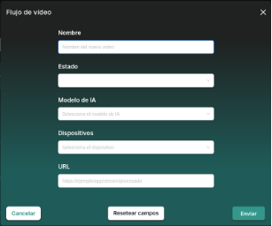

**Manual de usuario - CVSEC**

Mediante esta guía recorreremos todas las utilidades y funciones de CVSEC que un usuario puede manejar, para facilitar la comprensión y un correcto uso de la plataforma. 

CVSEC es un sistema en que el usuario podrá interactuar mediante la plataforma web y una aplicación computer vision (CV) que habitualmente irá instalada en un dispositivo y que hará que se lance de manera automática. Estos dispositivos estarán retransmitiendo imágenes en tiempo real mediante RTMP (Real Time Messaging Protocol) o RTSP (Real Time Streaming Protocol) y, mediante nuestra plataforma, podremos configurar dichos dispositivos y sus flujos de video, pudiendo aplicarles modelos preentrenados de inteligencia artificial (IA) de detección de ciertos elementos, configurar si la aplicación de dichos modelos será de aplicación en la totalidad de la imagen recibida o sólo en determinadas secciones que podremos configurar, y recibir notificaciones en base a la detección de estos elementos para planificar un método de actuación.

**Registro / Login**

pte tras determinar tema de  registro de usuarios

**Panel de control**

pte tras incluir localizaciones en el mapa

**Usuarios**

pte

**Dispositivos**

Listado de aquellos dispositivos dados de alta en la plataforma y sus características. Será necesario tener un dispositivo dado de alta para poder crear flujos de videos, pues deben tener un dispositivo asociado.

**Creación de un dispositivo**

En el apartado correspondiente, podremos dar de alta un nuevo dispositivo pulsando en el botón homónimo, y debiendo cumplimentar el formulario con los siguientes campos:

Daremos un nombre fácilmente identificable y único al dispositivo, no pudiendo haber más de un dispositivo con el mismo nombre, y pondremos la localización de éste mediante sus coordenadas  para que nos aparezca en el mapa y podamos visualizar nuestra red . Asignaremos un tipo al dispositivo (Smartphone, dispositivo edge o cámara móvil) y seleccionaremos a qué resolución transmite el dispositivo; en caso de no encontrar nuestra resolución se debe hablar con el equipo de mantenimiento para que la incluya.

**Funcionalidades de la tabla de dispositivos**

Una vez creado, nuestro dispositivo nos aparecerá en la tabla y se le habrá asignado una clave (ApiKey) que necesitaremos en  XXXXXXX. XPor defecto, en la tabla vendrá oculta, pero si pulsamos sobre ella se nos mostrará.

Podremos ordenar los dispositivos en la tabla en orden alfabético/numérico ascendente/descendente pulsando sobre las flechas ( 1) junto a los campos ID, Nombre, Tipo, Localización y/o Resolución, o filtrarlos mediante el cuadro de búsqueda ( 2) para mostrar aquellos que contengan, al menos parcialmente, el texto que introduzcamos. También podremos variar el número de resultados que mostrará cada página ( 3), siendo 5 el número 

por defecto, crear un nuevo dispositivo abriendo el formulario visto anteriormente ( 4) o eliminar algún dispositivo ( 5), debiendo marcar al menos uno de ellos en sus casillas para poder eliminarlo ( 6).

**Edición de un dispositivo**

En caso de querer modificar alguno de los campos de un dispositivo, podremos pulsar sobre el icono de la llave inglesa ( 7) y se nos mostrará un formulario similar al de creación, con los campos rellenos con los valores previamente introducidos. Bastará con modificar el/los campo/s que precisemos y pulsar sobre “Guardar cambios”.

**Flujos de video**

Un flujo de video es aquel que está siendo retransmitido por uno de nuestros dipositivos, debiendo estar el flujo asociado a éste. Podremos cargarle modelos de reconocimiento de IA que se procesarán durante la emisión del video en directo, pudiendo ver las etiquetas correspondientes al modelo detectado durante la propia retransmisión y delimitando el objeto o la zona donde se está detectando el item en cuestión.

**Creación de un flujo de video**

De manera similar a como se realiza para un dispositivo (paso necesario antes de la creación del primer flujo de video) pulsando en el botón “Nuevo Flujo de video” se nos abrirá un formulario que debemos rellenar:

El nombre, al igual que con el dispositivo, debe ser único y no podrá haber más de un flujo de video con el mismo nombre, y  podremos indicar si este flujo está Activo o Inactivo . Del mismo modo, podremos seleccionar qué modelo/s de IA se aplicarán al flujo de video (ver su apartado

correspondiente en caso de querer introducir uno nuevo), y debemos asociarlo a un dispositivo creado previamente. Por último, será necesario introducir la URL de retransmisión del video. Por protocolos de seguridad, ésta debe ser “https”, indicar el servidor de video e incluir un path para él. De forma automática esta URL se modificará incluyendo un número correspondiente al índice del flujo de video para evitar duplicidades, y conformando así a totalidad de la URL donde podremos ver el video ya procesado con la aplicación del/de los modelo/s de IA, en 

caso de haber seleccionado alguno .

**Funcionalidades de la tabla de los flujos de video**

Podremos ordenar los flujos de video en la tabla en orden alfabético/numérico ascendente/descendente pulsando sobre las flechas ( 1) junto a los campos ID, Nombre, Estado, Modelo IA, URL y/o Nombre del dispositivo, o filtrarlos mediante el cuadro de búsqueda ( 2) para mostrar aquellos que contengan, al menos parcialmente, el texto que introduzcamos. También podremos variar el número de resultados que mostrará cada página ( 3), siendo 5 el número 

por defecto, crear un nuevo flujo de video abriendo el formulario visto anteriormente ( 4) o eliminar algún flujo de video ( 5), debiendo marcar al menos uno de ellos en sus casillas para poder eliminarlo ( 6).

Por último, también podremos editar los campos del flujo de video y dibujar secciones donde se apliquen modelos de IA específicos o, directamente, visualizar la retransmisión con el procesa de dichos modelos, si los tuviese asociados, pulsando en ( 7) y ( 8) respectivamente. Desarrollamos estos apartados a continuación

**Edición de flujos de video y sectorización de aplicación de los modelos**

Pulsando sobre la llave inglesa ( 7) accederemos a una nueva página de edición del flujo de video. A la izquierda tendremos el formulario de edición de éste, pudiendo modificar el/los campo/s que precisemos y pulsando sobre el botón “Guardar cambios” para aplicar dichas modificaciones. 

PTE: Incluir foto de stream con el móvil y dibujo de polígonos

A la derecha tendremos todo lo relativo a la sectorización de la aplicación de los Modelos de IA. Si tenemos seleccionado algún Modelo de IA en nuestro flujo de video, éste se aplicará a la totalidad de la imagen grabada por la cámara, pero si queremos que se aplique sólo a una parte, podremos dibujar un polígono y decirle qué modelo queremos que se ejecute en dicha zona. Podremos tener el dispositivo funcionando y veremos en tiempo real la retransmisión por debajo del área de ejecución de los polígonos, permitiéndonos seleccionar los nodos del polígono con mayor exactitud acorde a nuestras necesidades y a la imagen real.

Para ello pulsaremos sobre el botón “Seleccionar polígono” que encontraremos en la parte central de la pantalla, sobre el reproductor dicho reproductor aparecerá con un mensaje de error si el flujo de video  no está activo ). 

En ese momento se nos habilitará un nuevo botón (  ) para iniciar la configuración de una zona. Debemos ponerle nombre a esta sección y seleccionar al menos un modelo de IA que aplicar en ella. IMPORTANTE: Los modelos seleccionables son aquellos que forman parte (están asociados) al flujo de video; en caso de querer añadir uno nuevo, se debe añadir antes al flujo de video, editándolo desde la parte izquierda de la pantall y guardar sus cambios.

Una vez seleccionados nombre y modelo/s, pulsamos en “Aceptar“ y podremos comenzar a dibujar nuestro polígono haciendo click sobre cada punto encima del reproductor donde queramos establecer un nodo y cambio de dirección de la línea. La zona de acción será proporcional a la resolución a la que transmite el dispositivo asociado al flujo de video, no teniendo que ocupar la totalidad del reproductor;  una buena práctica sería tener el flujo de video emitiendo para ver la imagen real y dibujar sobre ella . Cuando cerremos la zona, volviendo a llevar las líneas del polígono hasta el nodo inicial, ésta se cerrará, pero no debemos olvidar guardar los cambios.

El menú completo es el siguiente:

Los botones, de izquierda a derecha, nos permiten: -Cambiar entre secciones activas, si hay más de una. -Añadir una nueva sección.

-Editar el nombre o Modelo/s de IA de la sección. -Eliminar la sección al completo. -Guardar la sección.

-Deshacer el último nodo de la sección. -Eliminar todos los nodos de la sección.

**Modelos de IA**

Son aquellos modelos que nos permiten reconocer diferentes items (personas, maquinaria, fuego…) y que pueden ser aplicados a un flujo de video, para que éste, en directo, sea capaz de mostrarnos las etiquetas del reconocimiento de aquellos items que estén cargados en su modelo asociado.

**Adición de un modelo de IA**

En este apartado podremos añadir nuevos Modelos de IA, habiendo dos diferencias de uso:

1) Subida de un nuevo modelo a nuestro repositorio

Los modelos de IA permanecen alojados en  Minio. Si tenemos uno nuevo que hayamos entrenado nosotros mismos o descargado de algún sitio web, podemos añadirlo al listado pulsando sobre “Nuevo Modelo de IA”.

En la ventana que se nos abrirá, hemos de introducir u nombre para el modelo, una descripción y tendremos que habilitar la opción “Subir un nuevo modelo”, seleccionarlo desde nuestro ordenador y pulsar en “Aceptar”. Esto no sólo subirá el modelo a nuestro repositorio y nos permitirá tenerlo disponible para aplicarlo a un flujo de video, sino que creará una entrada en la tabla donde podremos consultar sus datos, siendo especialmente útil la consulta sobre qué reconoce el modelo en sí si lo hemos escrito en el apartado “descripción”.

2) Por otro lado, si en lugar de “Subir un nuevo modelo” seleccionamos la opción “Seleccionar un modelo”, esto nos permitirá crear una entrada en la tabla para Modelos que ya se encuentren almacenados en nuestro sistema, pudiendo alimentar así nuestra base de datos descriptiva sobre el uo de cada modelo.

**Funcionalidades de la tabla y edición de Modelos de IA**

Podremos ordenar los modelos de IA en la tabla en orden alfabético/numérico ascendente/descendente pulsando sobre las flechas ( 1) junto a los campos ID, Nombre, 

Descripción, Modelo IA y/o URI, o filtrarlos mediante el cuadro de búsqueda ( 2) para mostrar aquellos que contengan, al menos parcialmente, el texto que introduzcamos. También podremos variar el número de resultados que mostrará cada página ( 3), siendo 5 el número 

por defecto, crear un moelo abriendo el formulario visto anteriormente ( 4) o eliminar algún modelo ( 5), debiendo marcar al menos uno de ellos en sus casillas para poder eliminarlo ( 6). 

**Edición de modelos de IA**

En caso de querer modificar alguno de los campos de un modelo de IA, podremos pulsar sobre el icono de la llave inglesa ( 7) y se nos mostrará un formulario similar al de creación, con los campos rellenos con los valores previamente introducidos. Bastará con modificar el/los campo/s que precisemos y pulsar sobre “Guardar cambios”.

**Notificaciones**

En este apartado encontraremos aquellas notificaciones/alertas que se hayan configurado para ser notificadas al ser detectadas durante la emisión de un flujo de video,  no pudiendo ser insertadas manualmente (para eso tendríamos el POST por API) . 

**Funcionalidades de la tabla de notificaciones**

Podremos ordenar las notificaciones en la tabla en orden alfabético/numérico ascendente/descendente pulsando sobre las flechas ( 1) junto a cualquier campo excepto “Ajustes”, o filtrarlos mediante el cuadro de búsqueda ( 2) para mostrar aquellas que contengan, al menos parcialmente, el texto que introduzcamos. También podremos variar el número de resultados que mostrará cada página ( 3), siendo 5 el número por defecto o eliminar alguna notificación ( 4), debiendo marcar al menos una de ellas en sus casillas para poder eliminarla ( 5). 

Por último, también podremos, pulsando en la llave inglesa de su fila ( 7), editar un par de campos de la notificación y ver el histórico de dichas modificaciones o, pulsando en el icono del ojo ( 8), visualizar un video con varios segundos anteriores a lo que ha hecho saltar la notificación y varios segundos posteriores, así como los detalles de dicha notificación para facilitar su consulta completa. 

**Edición de una notificación**

En este apartado encontraremos, en la poarte izquierda, el listado de propiedades de la notificación para tener a mano su información, y a la derecha un histórico de los cambios. La mayoría de los campos, como la propia creación de la notificación, no serán editables. No obstante, sí podremos asignar la notificación a un usuario y modificar el estado de la notificación (Desatendida/En curso/Atendida).

Esto nos permitirá, en caso de acción necesaria, asignarla a un usuario para que le dé solución, y que pueda cambiar, del mismo modo, el estado de ésta cuando la haya resuelto. De esta forma, y mediante el histórico, podremos hacer comprobaciones y estudios estadísticos del estado de las alertas y los tiempos de su resolución.

**Visualización de una notificación**

Esta página nos mostrará los detalles actuales de una notificación (no el histórico, sólo el estado actual) en la parte izquieda de la pantalla, y un video de la propia notificación en la derecha. Dicho video nos mostrará una grabación tomada por el dispositivo acorde a un flujo de video y  cuyos parámetros hayamos especificado acorde a los modelos de IA cargados para recibir esta notificación/alerta. Se mostrarán varios segundos previos al detonante de la notificación y otros tantos segundos posteriores.
